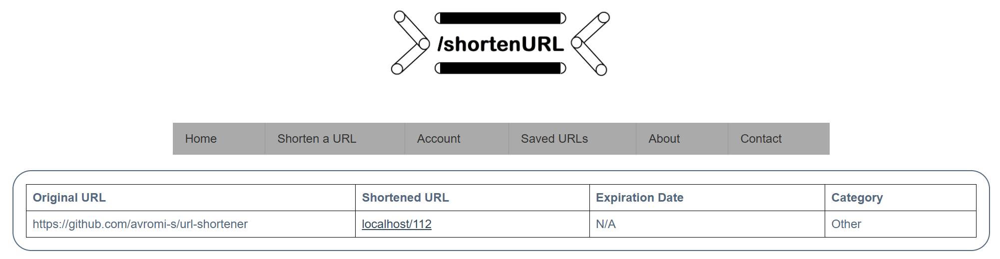

# url-shortener
A web application that provides a URL shortening service, similar to websites like tinyurl.com.

The purpose of this web application is to allow long URLs to be shortened for conciseness and readability.

## How to use
Users enter a URL for another website and this web application generates a shortened URL which, when visited, will
redirect to the original URL. 
Users can create a login to save the URLs they have shortened.

|                         |                                    |
|-------------------------|------------------------------------|
| Enter a URL to shorten  |   |
| Receive a shortened URL |  |

## Setup
In order to run the web app, you need to run Apache server and MySql.

First, install [XAMPP](https://www.apachefriends.org/index.html). 

### Apache
Apache server needs to be setup so that the root directory points correctly to this directory in order for everything to
work.

To do this, you can either put all the project files directly in the htdocs folder (which is the default root), or you can
update the root directory by going to `[XAMPP_DIRECTORY]\apache\conf\httpd.conf` and updating the filepath for both
`DocumentRoot` AND `Directory` to this project's directory.

### Database & Gmail
- Create a new database in MySql
- Import the `mysql\create_db.sql` file into the database to create the tables
- Update config.php with the database credentials
- Update config.php with gmail credentials
  - this is only used for sending emails from the Contact page. You can skip this if you will not be using that page.

Once the above is set up, the web app should be accessible from the browser via `http://localhost/index.php`.